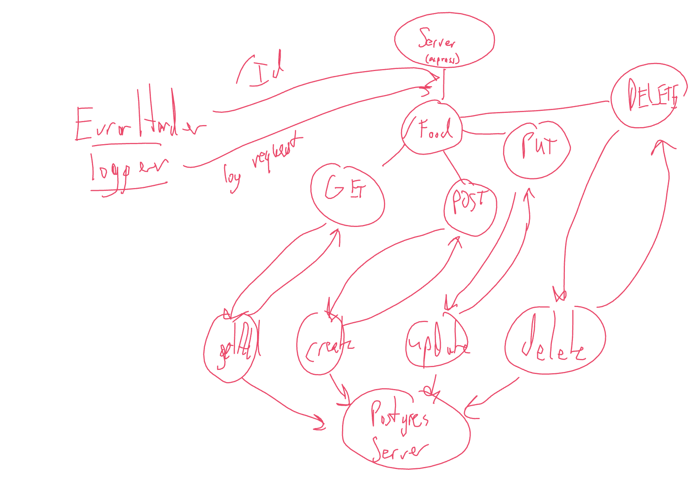

# class-03-rest

Author: Jacob Knaack

Demo REST API with full CRUD

Deployed Links:
  In Progress

## UML

## Routes

### /food

#### GET

* Status Code 200
* JSON response:
  * Returns and array of `Food` containing
    * name: STRING
    * calories: NUMBER

#### POST

* Status Code 200
* JSON response:
  * Creates a new `Food` item
  * Returns a newly created `Food` item containing:
    * name: STRING
    * calories: NUMBER

### /food/:foodId

#### GET

* Status Code 200
* JSON response:
  * Returns a single instance `Food` based on the `foodId` containing:
    * name: STRING
    * calories: NUMBER

#### PUT

* Status Code 200
* JSON response:
  * Updates a single instance of `Food` based on the `foodId`, returns newly updated item containing:
    * name: STRING
    * calories: NUMBER

#### DELETE

* Status Code 204
* Removes a single instance of `Food` based on the `foodId`, no body:
